# Trello
- trello: https://trello.com/b/ru0my7Ny/deploiement-d-infrastructure-cloud-haute-disponibilite

# Rapport sur l'Infrastructure Déployée sur Microsoft Azure

## Introduction

Le présent rapport détaille l'infrastructure récemment déployée sur la plateforme Microsoft Azure pour ProdigySoftware. Cette infrastructure a été conçue pour fournir une solution hautement disponible, évolutive et sécurisée pour héberger les services web et les applications métier de l'entreprise.

## Architecture de l'Infrastructure

L'infrastructure déployée est basée sur un modèle de réseau virtuel (VNet) contenant un sous-réseau public et un sous-réseau privé, ainsi que deux Load Balancers pour équilibrer la charge entre les VMs et assurer une haute disponibilité.

### Réseau Virtuel (VNet)

Le réseau virtuel (VNet) sert de base pour l'ensemble de l'infrastructure. Il est divisé en deux sous-réseaux :

1. **Sous-réseau Public** : Ce sous-réseau est destiné à héberger les VMs serveurs web accessibles depuis Internet. Les VMs dans ce sous-réseau sont équilibrées par un Load Balancer public, qui distribue le trafic entrant sur les VMs Web pour fournir une haute disponibilité.

2. **Sous-réseau Privé** : Le sous-réseau privé abrite les VMs de la couche métier qui ne sont pas accessibles depuis l'Internet. Les VMs de la couche métier sont équilibrées par un Load Balancer privé, qui assure une distribution équilibrée du trafic interne entre les VMs pour des performances optimales et une résilience accrue.

### Load Balancers

1. **Load Balancer Public** : Le Load Balancer public est exposé à Internet et répartit la charge entre les VMs serveurs web dans le sous-réseau public. Il permet d'assurer une distribution équilibrée du trafic entrant sur les VMs Web, améliorant ainsi la disponibilité et les performances du service.

2. **Load Balancer Privé** : Le Load Balancer privé est interne au réseau virtuel (VNet) et équilibre la charge entre les VMs de la couche métier situées dans le sous-réseau privé. Il garantit que les requêtes internes sont dirigées de manière optimale vers les VMs de la couche métier, renforçant ainsi la résilience et l'efficacité du service.

### Machines Virtuelles (VMs)

Dans le sous-réseau public, trois VMs serveurs web ont été déployées pour répondre aux requêtes provenant d'Internet. Ces VMs sont associées au Load Balancer public pour une distribution équilibrée du trafic entrant.

Dans le sous-réseau privé, trois VMs de la couche métier ont été déployées pour gérer les tâches de traitement métier et d'accès aux données. Ces VMs sont associées au Load Balancer privé pour une distribution équilibrée du trafic interne.

## Sécurité

La sécurité est une priorité dans l'architecture de l'infrastructure. Plusieurs mesures de sécurité ont été mises en place :

1. **Groupes de Sécurité Réseau (NSG)** : Des règles de sécurité réseau ont été définies pour contrôler le trafic entrant et sortant des sous-réseaux public et privé. Ces règles NSG garantissent que seuls les flux de trafic autorisés sont autorisés, renforçant ainsi la sécurité du système.

2. **Isolation des Réseaux** : En utilisant des sous-réseaux distincts pour le trafic public et privé, nous avons assuré une séparation claire entre les VMs accessibles depuis Internet et celles qui ne le sont pas, minimisant ainsi les risques potentiels d'accès non autorisés.

## Schéma de l'Infrastructure

## Conclusion

L'infrastructure déployée sur Microsoft Azure pour ProdigySoftware offre une plateforme robuste et sécurisée pour héberger les services web et les applications métier de l'entreprise. En utilisant un modèle de réseau virtuel (VNet) avec des sous-réseaux public et privé, ainsi que des Load Balancers pour équilibrer la charge, nous avons assuré une haute disponibilité, une évolutivité et une performance optimale.

La sécurité étant une priorité, nous avons mis en place des règles de sécurité réseau pour contrôler le trafic entrant et sortant. L'isolation des réseaux permet également de minimiser les risques potentiels d'accès non autorisés.
