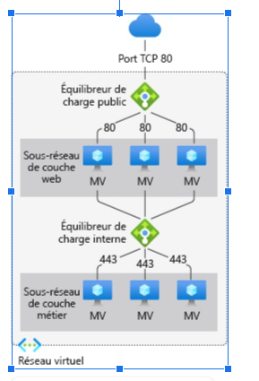

# Déploiement d'Infrastructure Cloud Haute Disponibilité

## Ressources
- trello: https://trello.com/b/ru0my7Ny/deploiement-d-infrastructure-cloud-haute-disponibilite

## Contexte du projet

Fort du succès de leur collaboration précédente, Global Logistics Group renouvelle sa confiance envers Prodigy Software pour renforcer davantage son infrastructure cloud. Cette fois-ci, Global Logistics Group a besoin d'une architecture hautement disponible et évolutive pour soutenir son activité en pleine croissance. Les administrateurs Cloud de Prodigy Software, Les administrateurs Cloud, sont chargés de déployer cette nouvelle infrastructure.

La première étape consiste à déployer un équilibrateur de charge public. Les administrateurs Cloud se concentrent sur la mise en place d'un équilibrateur de charge public pour gérer la distribution du trafic entrant vers les différentes instances des serveurs web de Global Logistics Group. Cela garantit une répartition efficace des charges de travail entrantes et assure une disponibilité continue du service web pour les utilisateurs.

Ensuite, Les administrateurs Cloud créent un sous-réseau de couche web pour héberger les serveurs web de Global Logistics Group. Ils s'assurent que ce sous-réseau est correctement configuré pour permettre aux instances des serveurs web de communiquer entre elles et avec l'équilibrateur de charge public. La sécurité est une priorité, donc ils mettent en place les règles de sécurité nécessaires pour protéger le trafic web.

La prochaine étape consiste à déployer un équilibreur de charge privé. Cet équilibreur de charge privé est destiné à gérer le trafic entre les différentes instances des serveurs de la couche métier. Les administrateurs Cloud veillent à ce que cet équilibreur de charge privé soit configuré pour optimiser les performances du sous-réseau de couche métier et assurer la haute disponibilité des services critiques de l'entreprise.

Enfin, ils créent un sous-réseau de couche métier pour héberger les serveurs d'application et de base de données de Global Logistics Group. Ce sous-réseau est conçu pour garantir l'isolation et la sécurité des services de la couche métier. Les administrateurs Cloud mettent également en place des règles de sécurité avancées pour contrôler l'accès aux ressources de la couche métier.

Au cours de tout le processus, Les administrateurs Cloud utilisent les meilleures pratiques en matière de sécurité et de haute disponibilité pour concevoir une architecture cloud robuste et évolutive. Ils testent rigoureusement chaque composant et s'assurent que l'ensemble de l'infrastructure fonctionne harmonieusement.

## Modalités pédagogiques
Selon la méthode de gestion de projet Agile.

Réaliser l'infrastructure présente en ressource, (ressource Infra à deployer).

La sous-couche web sera soit un serveur nginx ou apache

La sous-couche tiers ne sera pas à provisionner actuellement

## Modalités d'évaluation
Un rapport professionnel relatant des diverses étapes proposées.

## Livrables
Un rapport
Un Trello
Des fichiers de configuration terraform ou python

## Critères de performance
L'architecture est fonctionnelle